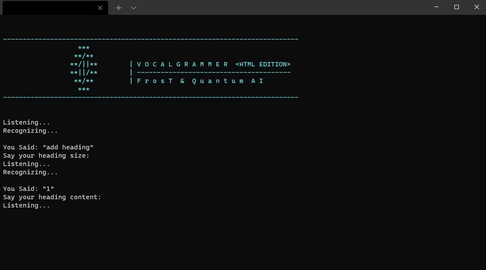
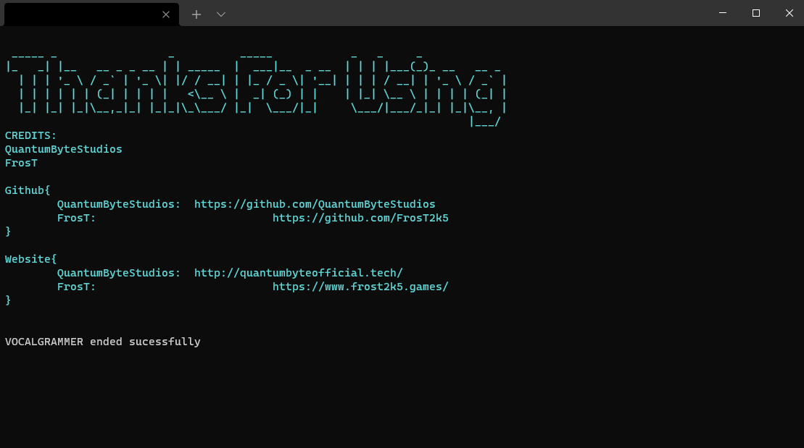
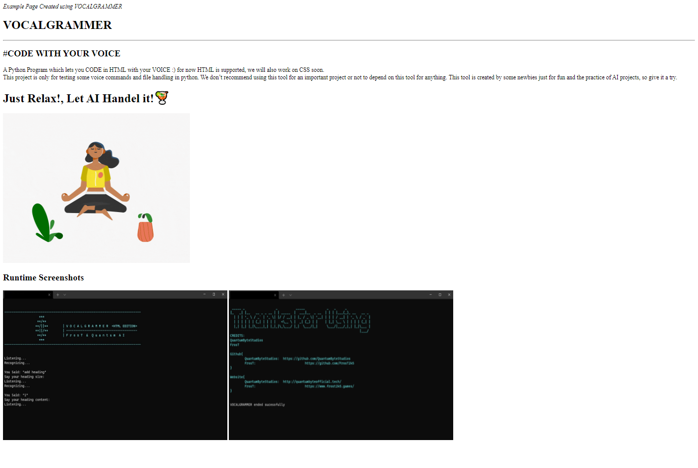

# Vocalgrammer_HTML_Edition🤩
<b>
#CODE WITH YOUR VOICE
</b>
<!---->
A Python Program which lets you <b>CODE in HTML with your VOICE</b> :) 
-for now <b>HTML</b> is supported, we will also work on <b>CSS</b> soon.

<h1>Just Relax!, Let AI Handel it!🍹</h1>

This project is only for testing some voice commands and file handling in python. We don’t recommend using this tool for an important project or not to depend on this tool for anything. This tool is created by some newbies just for fun and the practice of AI projects, so give it a try.

<h1>Runtime Screenshots</h1>

<h1><i>Example Page Created using VOCALGRAMMER</i></h1>

